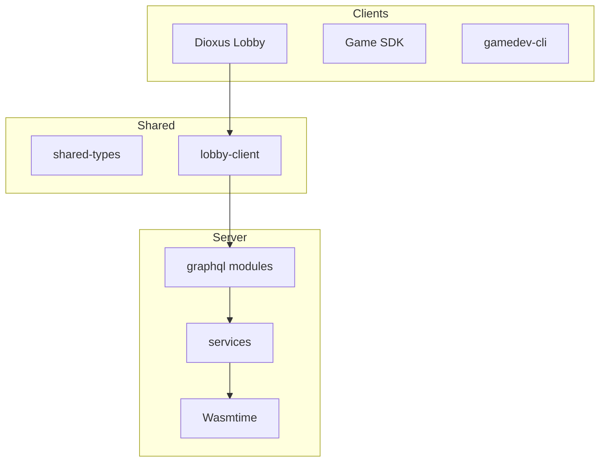

# UPJŠ GDD Platform — Refactor & UI Plan

> Living document. Update the **Progress** section as work completes.

## Overview

UPJŠ GDD Platform is a single-container multiplayer web game platform: Rust/Actix server, WASM game logic, Dioxus lobby SPA, GraphQL + WebSockets, SQLite.

**Design reference:** `docs/ui-proposal/` — "Calm & Credible" design system (`Image 18.markdown`).

**Brand:** UPJŠ GDD Platform (platform name in UI).

---

## Progress

| Phase | Task | Status |
|-------|------|--------|
| 0 | Save this plan | ✅ Done |
| 0 | GitHub Actions CI | ✅ Done |
| 0 | Expand README / architecture | ✅ Done |
| 3 | Design tokens in Tailwind | ✅ Done |
| 3 | AppShell + shared UI components | ✅ Done (sidebar + header per proposal) |
| 3 | Home page visual refresh | ✅ Done (Discover hero, trending, quick links) |
| 3 | New routes: Games, Lobbies, Settings, Profile | ✅ Done (stub data for leaderboard/history/tokens) |
| 2 | Split `lobby/src/main.rs` → modules | ✅ Done (main.rs ~175 lines; pages + components extracted) |
| 1 | Split `graphql_api.rs` | ✅ Done (`server/src/graphql/{mod,types,query,mutation,subscription}.rs`) |
| 1 | Server integration tests | ✅ Done (8 integration tests across `lobby_flow` + `engagement`) |
| 1 | Badges + notifications API | ✅ Done (`user_engagement.rs`, wired in lobby header/profile/settings) |
| 3 | Lobby room + developer pages UI | ✅ Done (design tokens, UI kit, toast, mobile nav) |
| 3 | Professional UI polish (Phases 1–4) | ✅ Done |
| 4 | Ship tic-tac-toe in Docker | ✅ Done |
| 4 | GET /health endpoint | ✅ Done |
| 4 | Structured logging (`tracing`) | ✅ Done (`tracing` + `tracing-actix-web`, `RUST_LOG`) |
| 5 | Wire client stubs → GraphQL APIs | ✅ Done (tokens, history, leaderboard, deployments, stats, activity, profile) |
| 5 | Lobby SDK crate / GraphQL codegen | ⬜ Pending |

---

## Phase 0 — Foundation

- [x] CI: `cargo test`, `cargo clippy`, lobby CSS build, game-sdk npm build
- [x] README: architecture, env vars, local dev
- [x] Structured logging — `tracing` + `RUST_LOG` on server hot paths
- [ ] Add `lobby` to root Cargo workspace; align Rust edition 2024
- [ ] `.gitignore` hygiene

## Phase 1 — Backend tightening

Split `server/src/graphql_api.rs` (~1,300 lines):

```
server/src/graphql/
  mod.rs, query.rs, mutation.rs, subscription.rs, types.rs
server/src/services/
  lobby_service.rs, game_service.rs, auth_service.rs, upload_service.rs
server/src/repos/
  user_repo.rs, lobby_repo.rs, game_repo.rs
```

- Integration tests for lobby create → start → game flow
- Auth hardening (session expiry)
- Game rehydration on server restart (spike)

## Phase 2 — Lobby modularization

Target structure:

```
lobby/src/
  main.rs              # App shell + router (< 200 lines goal)
  models.rs            # Shared types, routes, constants
  api/
    graphql.rs
    subscriptions.rs
    config_bridge.rs
  pages/
    home.rs, games.rs, game_detail.rs, lobbies.rs, settings.rs, profile.rs
    lobby_room.rs, game_result.rs, developer.rs
  stub/
    mod.rs             # Client-side mock data for UI not yet in GraphQL
  components/
    layout/app_shell.rs
    ui/ (button, badge, status_dot, section_card, error_banner)
    game/ (game_card, game_catalog)
    lobby/ (chat, config, seats)
    dev/ (upload_diagnostics, draft_row)
```

- Wire `sdk/rust/shared` RealtimeClient to real GraphQL WS
- Extract iframe bridge types to `shared-types`

## Phase 3 — Design system

Tokens from `Image 18.markdown` → `lobby/tailwind.config.js`.

Components per proposal:
- `PrimaryButton` / `GhostButton`
- `StatusBadge` (traffic-light pips)
- `GameCard` (16:9 hero, gradient overlay)
- `DataTable` (dense lobby browser)
- `DevConsole` (monospace JSON)
- `AppHeader` (sticky nav)

Screen rollout:
1. Home dashboard (`Image 15.html`) — **started**
2. Lobby room (`Image 6.html`) + lobby table (`Image 10.html`)
3. Developer uploads (`Image 8.html`) + game detail (`Image 2.html`)
4. Settings + profile (`Image 4.html`, `Image 12.html`)

## Phase 4 — Platform hardening

- Prebuild tic-tac-toe into Docker `/app/games`
- `GET /health` endpoint
- Backup runbook (SQLite + `/app/games`)

## Phase 5 — SDK & CLI

- Single GraphQL operation source (codegen)
- Merge/clarify `@upjs-gdd/game-sdk` vs `sdk/js`
- CLI: unsupported backend/frontend kinds fail at init/build; `--strict` on build; session login via `--display-name` + `--password`
- Hide or implement stub CLI backends (C#, Unity, etc.) — **partial**: enum kept for serde; init/build reject unimplemented kinds

### Client data sources (updated)

| Feature | Status | API |
|---------|--------|-----|
| Game catalog metrics | ✅ Wired | `gameTypes { activePlayers, featured, tags, avgSessionMins, creatorDisplayName }` |
| KPI trend deltas | ✅ Wired | `platformStats.trends` (snapshot history in DB) |
| Match duration | ✅ Wired | `finishedGamesByType.durationSecs` from `started_at` |
| Review helpful votes | ✅ Wired | `markReviewHelpful` mutation |
| Display name edit | ✅ Wired | `updateDisplayName` mutation |
| Auth sessions | ✅ Wired | `registerUser` / `signUp` / `loginWithPassword` → `sessionToken` |
| Demo mode | ✅ Intentional | `stub/demo_api` — offline only |
| Cosmetic fallbacks | ✅ Intentional | `game_media()`, `demo_images` when cover art missing |

---

## Success metrics

| Metric | Before | Target |
|--------|--------|--------|
| `lobby/src/main.rs` lines | ~2,800 | < 200 |
| `graphql_api.rs` lines | ~1,970 | split into 5 modules (largest: `mutation.rs` ~950) |
| Server integration tests | 0 | 5 lobby-flow tests (+ 2 unit tests) |
| CI pipeline | none | every PR |
| Design token coverage | 0% | 100% lobby |
| Games in Docker image | 0 | ≥ 1 |

---

## Architecture (target)



---

*Last updated: 2026-06-13 (stub replacement — real catalog metrics, KPI trends, session auth)*

### Next up
1. Notification subscription (`myNotificationsUpdated`) for live inbox
2. Full lobby start integration test (requires built `logic.wasm` for tic-tac-toe)
3. GraphQL codegen + SDK merge (Phase 5)
4. Phase 0: lobby in root workspace, `.gitignore` hygiene
